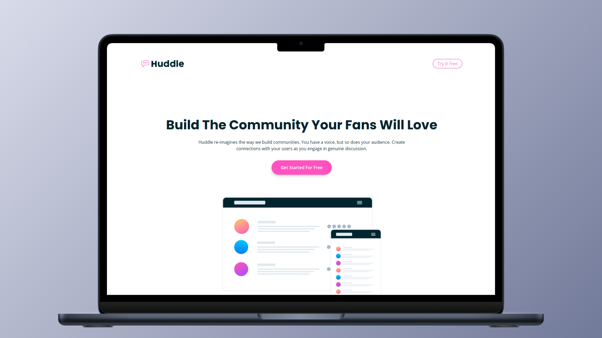

<h1 align="center">Huddle Landing Page With Curved Sections</h1>
<p align="left">
  <a href="README_ES.md" target="_blank">
    Ver README en Español
  </a>
</p>
<p>This project showcases a visually appealing and well-organized landing page, designed with curved sections to provide a modern and dynamic look. The design was inspired by a project from Frontend Mentor and was developed to strengthen and practice key skills in HTML and CSS.</p>
<hr>

<h1 align="center">Technologies Used</h1>
<div align="center">
  
  
</div>
<hr>

<h1 align="center">Objective</h1>
<p>The main objective of this project is to consolidate knowledge in advanced HTML and CSS, applying principles such as proper HTML semantics, the BEM methodology (Block, Element, Modifier), and other essential web design concepts. By replicating an existing design, the project aims to deepen the understanding of structure and styling used in modern web pages.</p>
<hr>

<h1 align="center">Main Features</h1>
<ul>
  <li><b>Curved Sections:</b> The layout stands out by using curved section dividers, adding a contemporary touch and breaking away from traditional flat design conventions.</li>
  <li><b>Intensive Practice:</b> This project provided an opportunity to intensively practice building complex layouts, improving problem-solving skills in frontend development.</li>
  <li><b>Standards Compliance:</b> Great attention was given to following best practices and coding standards in both HTML and CSS, ensuring clean and readable code.</li>
  <li><b>BEM Methodology:</b> The BEM methodology was consistently applied to structure and organize the CSS, promoting modular and maintainable development.</li>
</ul>
<hr>

<h1 align="center">Skills Acquired</h1>
<ul>
  <li>Reinforcement of HTML and CSS knowledge</li>
  <li>Practice in reproducing existing web designs</li>
  <li>Implementation of BEM methodology for better CSS structure</li>
  <li>Application of advanced web design concepts</li>
</ul>
<hr>

### How to Use

1. Clone this repository to your local machine:

   ```sh
   git clone https://github.com/jordanmedinaortiz/huddle-landing-page-with-curved-sections.git
   cd huddle-landing-page-with-curved-sections
   ```

2. Open the <code>index.html</code> file in your preferred web browser.

3. Explore the curved sections and observe the implementation of the learned concepts.

<p>This project has been a valuable learning and practice experience, contributing to the development and consolidation of essential frontend skills.</p>
<p>You can view the project demo <a href="https://jordanmedinaortiz.github.io/huddle-landing-page-with-curved-sections/">here</a>.</p>

